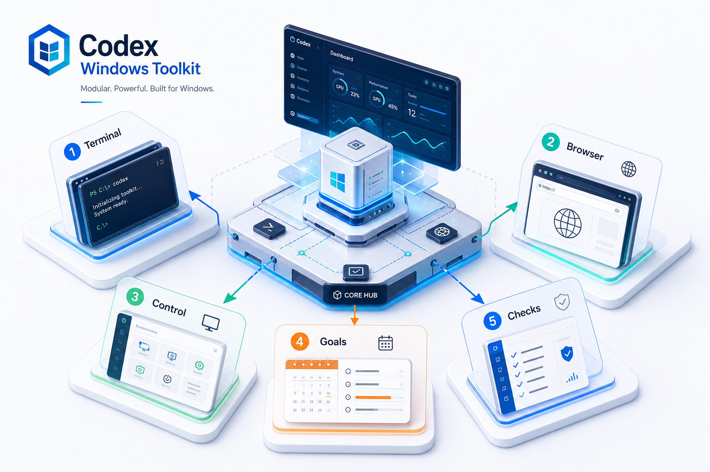
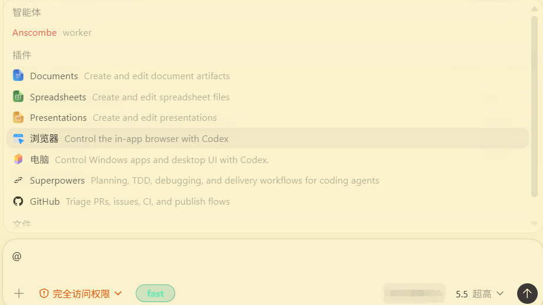
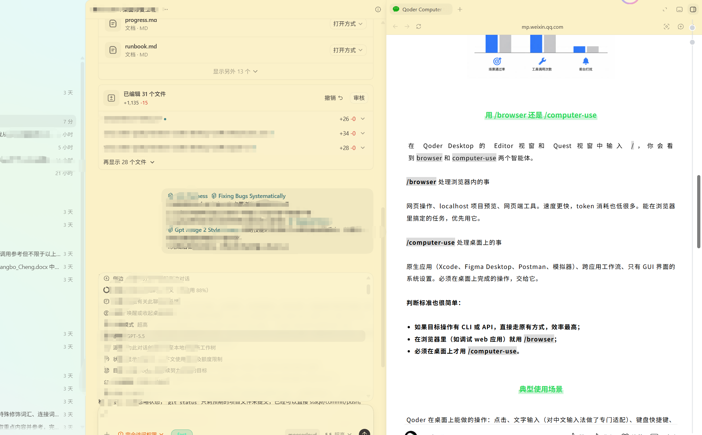
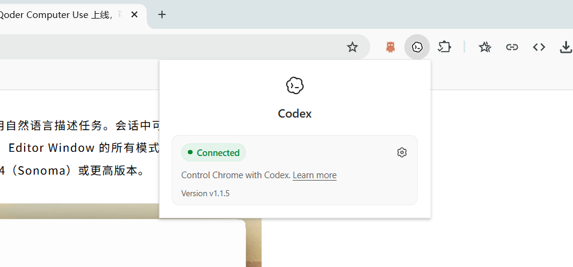
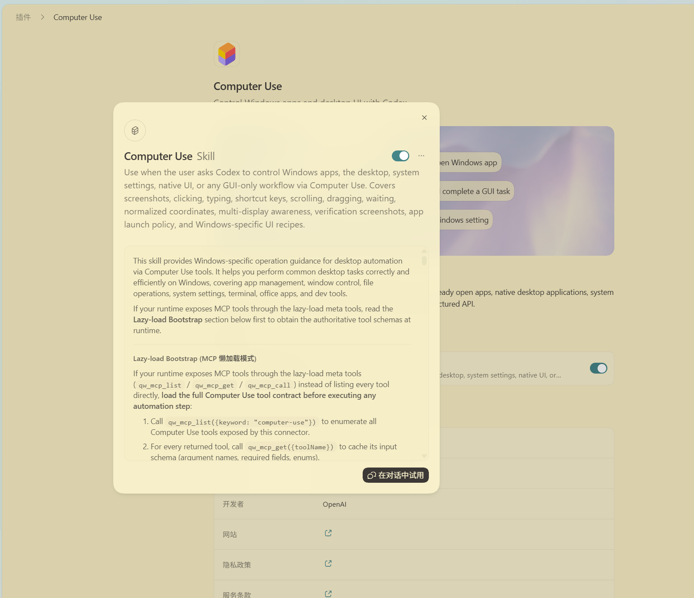
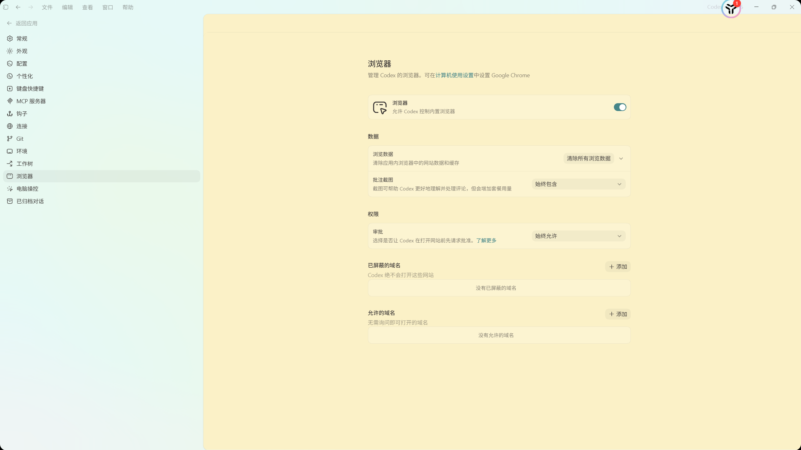
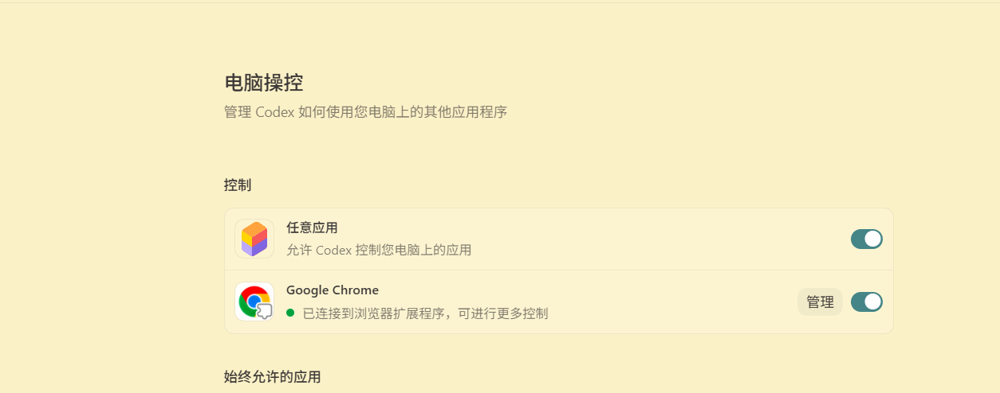
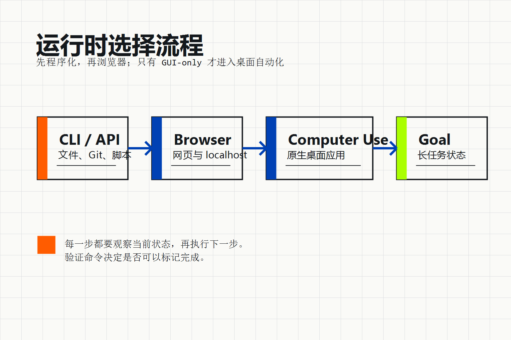
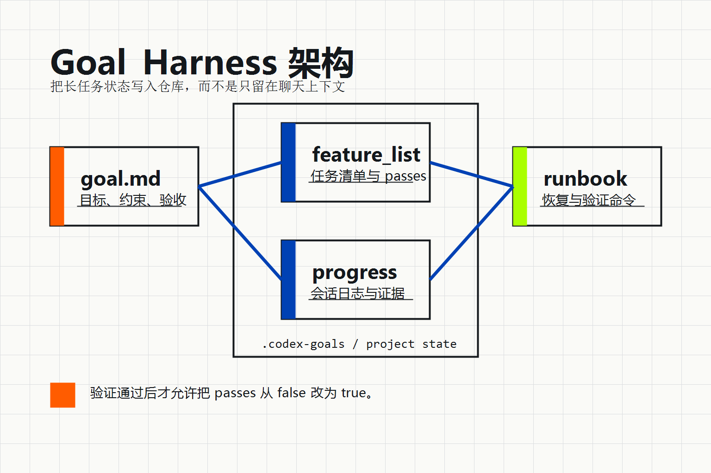

# Codex Desktop Windows Toolkit



Chinese README: [README.md](README.md)

This repository packages the Windows Codex Desktop capability work into a publishable, auditable, reusable engineering project. It does not modify the app binary or copy private runtime state from the local machine. Instead, it provides safe templates, validation scripts, runbooks, and durable goal-state files so Browser, Computer Use, plugins, MCP, and `/goal` fallback can cooperate more reliably on Windows.

## Background

On Windows, whether Codex Desktop feels fully functional depends on multiple pieces lining up at once: plugins must be enabled, Node and Python must be discoverable, MCP servers must start, the Browser helper must resolve, Computer Use must have proper desktop permissions, and `/goal` must be available in the current build or account. If any link fails, the user experiences missing interfaces or unavailable features.

This project follows the product split described in the Qoder Computer Use article: browser tasks should stay with Browser, while native desktop applications should go through Computer Use. It also borrows the long-task organization style from Harness Engineering, storing objective, task list, progress, and validation commands in the repository so context survives compression, app restarts, and capability changes.

## Principles

1. Prefer commands and APIs over visual automation whenever possible.
2. Use Browser first for web pages and local previews.
3. Reserve Computer Use for GUI-only desktop work.
4. Keep long tasks durable with project-local state.
5. Keep release assets redacted and safe to publish.

## Latest Feature Screenshots

The screenshots below come from the `images/` directory and show the latest functional state: chat commands, full command surface, built-in browser, browser plugin, Computer Use, settings, and unlocked desktop control.

<table>
  <tr>
    <td align="center" width="50%">
      
      <div>Chat commands ready</div>
    </td>
    <td align="center" width="50%">
      
      <div>Command surface ready</div>
    </td>
  </tr>
  <tr>
    <td align="center" width="50%">
      
      <div>Built-in browser ready</div>
    </td>
    <td align="center" width="50%">
      
      <div>Browser plugin ready</div>
    </td>
  </tr>
  <tr>
    <td align="center" width="50%">
      
      <div>Computer Use ready</div>
    </td>
    <td align="center" width="50%">
      
      <div>Computer Use on Windows available</div>
    </td>
  </tr>
  <tr>
    <td align="center" width="50%">
      
      <div>Settings UI ready</div>
    </td>
    <td align="center" width="50%">
      
      <div>Unlocked desktop control</div>
    </td>
  </tr>
</table>

## Runtime Layers



Recommended execution order:

| Layer | Best for | Repo assets |
| --- | --- | --- |
| Command line / API | files, Git, scripts, config, packaging, validation | `tools/*.ps1`, `tests/run-tests.ps1` |
| Browser | web pages, local previews, visible DOM, frontend verification | `docs/browser-runtime.md` |
| Computer Use | native desktop apps, system settings, cross-app GUI flows | `docs/computer-use.md` |
| Goal Harness | long tasks, cross-session progress, resumable execution | `.codex-goals/`, `feature_list.json` |

## Durable Task State



A typical repair flow looks like this:

1. Run `init.ps1` to restore current task state.
2. Read `feature_list.json` to find the highest-priority unfinished task.
3. Fix configuration or scripts with PowerShell and validate immediately.
4. Use Browser for webpage or local preview verification.
5. Switch to Computer Use only when a desktop app is required.
6. Mark only the completed feature's `passes` field from `false` to `true`.
7. Record commands, results, and follow-up work in `progress.txt` and `.codex-goals/.../progress.md`.
8. Finish with `tests/run-tests.ps1` and `tools/package-release.ps1`.

## Repository Layout

```text
AGENTS.md       session rules
CLAUDE.md       Harness Engineering entry point
README.md       Chinese documentation
README.en.md    English documentation
docs/           Browser, Computer Use, Goal, Security, Release docs
templates/      redacted Codex configuration templates
tools/          export, validation, and release packaging scripts
tests/          project validation entry point
images/         latest feature screenshots
.codex-goals/   durable goal state
.claude/        planner / generator / evaluator / hooks
```

## Quick Start

```powershell
cd C:\Users\admin\Desktop\test
powershell -NoProfile -ExecutionPolicy Bypass -File .\init.ps1
powershell -NoProfile -ExecutionPolicy Bypass -File .\tests\run-tests.ps1
```

To inspect private Codex configuration, do not copy `.codex` directly. Export it into the gitignored `artifacts/` directory:

```powershell
powershell -NoProfile -ExecutionPolicy Bypass -File .\tools\export-codex-assets.ps1
```

Build a release package:

```powershell
powershell -NoProfile -ExecutionPolicy Bypass -File .\tools\package-release.ps1
```

The package is written to `dist/`, which is not tracked by Git.

## Article Mapping

The Qoder article argues that Computer Use should not be reduced to screenshot-based coordinate guessing. It should rely on structured UI awareness and an observe-execute-review loop. The tool shapes in Windows Codex Desktop are different, but the engineering principle transfers cleanly:

- Browser handles structured web interfaces.
- Computer Use handles native GUI work that requires desktop state.
- Harness files preserve long-task state.
- Validation scripts turn "looks done" into repeatable checks.

See `docs/research/wechat-qoder-computer-use.md` for the supporting note.

## Security Boundary

This repository does not commit:

- API keys, OAuth tokens, cookies, browser login state.
- `.credentials.json`, `auth.json`, Codex SQLite databases, or WAL/SHM files.
- Any real `.codex/config.toml` containing live environment variables.
- Screenshots that contain private desktop content.

## Verification and Release

Minimum release bar:

```powershell
powershell -NoProfile -ExecutionPolicy Bypass -File .\tests\run-tests.ps1
powershell -NoProfile -ExecutionPolicy Bypass -File .\tools\package-release.ps1
git status --short
```

`tests/run-tests.ps1` checks:

- Required files exist.
- JSON parses correctly.
- The Chinese README has no English section headings.
- The English README exists and has no Chinese section headings.
- Both READMEs reference at least three local images.
- README image paths resolve.
- Common secret patterns are not present.
- The packaging script can produce a zip.

## Who This Is For

This project fits people who use Codex Desktop on Windows for the long term, especially when Browser, Computer Use, plugins, MCP servers, and goal workflows are all enabled but the user still wants the experience packaged as a clean public repository.

It also works as a template for turning a local workflow into a public artifact: keep structure, scripts, and validation methods, while stripping secrets, session state, and one-off caches.

## Sources

- OpenAI Codex introduction: https://openai.com/index/introducing-the-codex-app/
- OpenAI Codex use cases: https://developers.openai.com/codex/explore
- Qoder WeChat article: https://mp.weixin.qq.com/s/rx9yNaCJcBh9a_8dOedOlw
- Local verification notes: `docs/research/local-sources.md`
- Image generation notes: `docs/research/image-generation.md`
