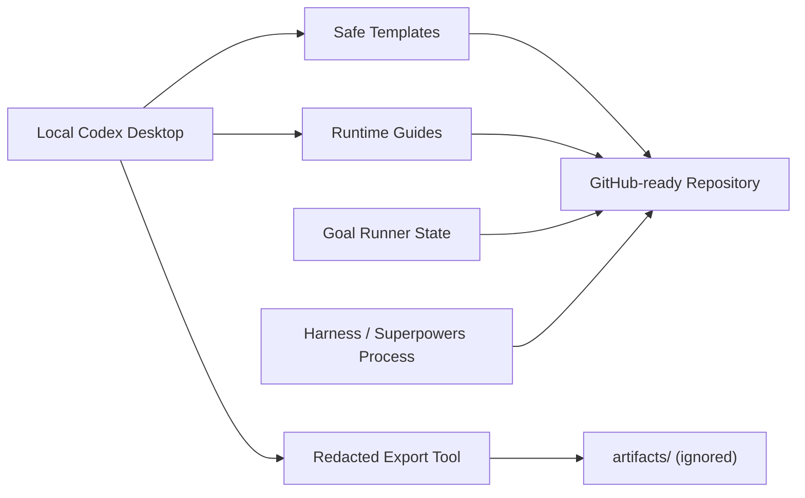
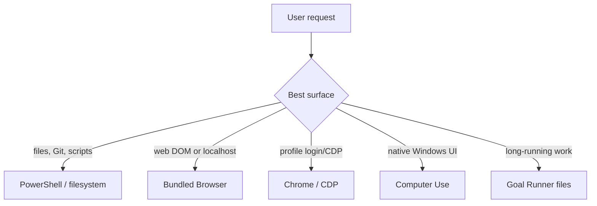
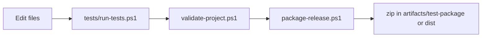

# Architecture

This repository is a documentation-first Windows toolkit with a small PowerShell automation layer.

## System Map



## Components

| Component | Path | Responsibility |
|-----------|------|----------------|
| Public entry | `README.md` | Explains purpose, quick start, verification, and references |
| Codex rules | `AGENTS.md` | Defines repository rules for Codex sessions |
| Harness map | `CLAUDE.md` | Optional Harness Engineering map for compatible agents |
| Goal state | `.codex-goals/windows-codex-desktop-toolkit/` | Durable `/goal` fallback files |
| Validation | `tests/run-tests.ps1` | Single command to validate release readiness |
| Project validator | `tools/validate-project.ps1` | Required-file, JSON, README image, and secret checks |
| Exporter | `tools/export-codex-assets.ps1` | Redacted local Codex evidence export |
| Installer | `tools/install-codex-config.ps1` | Dry-run-first template installer |
| Packager | `tools/package-release.ps1` | Creates release zip after validation |
| Templates | `templates/` | Safe Codex snippets with placeholders |

## Runtime Surfaces



## Data Policy

Tracked files contain only templates, docs, source scripts, and generated README media. Runtime exports, release archives, and any local Codex evidence go under ignored directories:

```text
artifacts/
dist/
```

## Verification Flow



The validator is intentionally conservative. Passing it does not replace manual review for secrets before pushing to GitHub.

